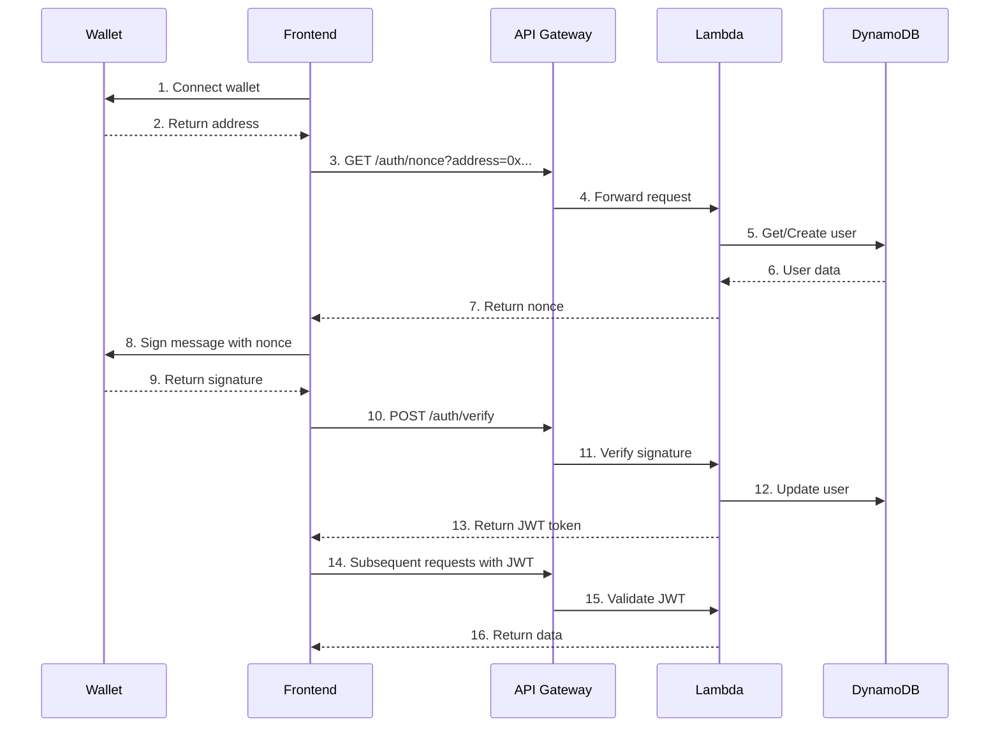
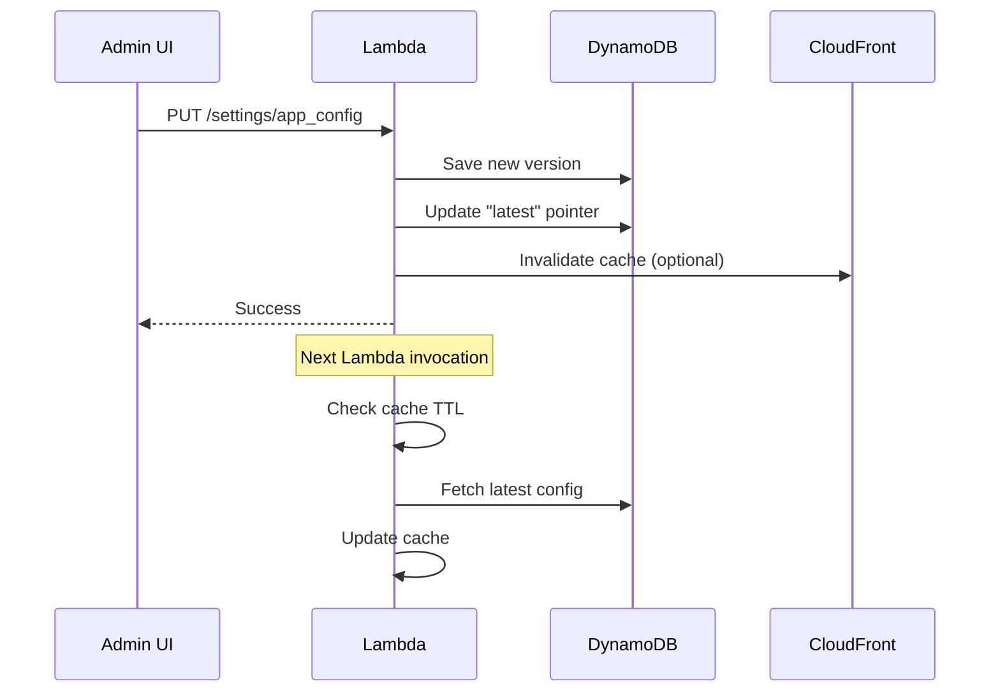

# Web3 Integration Design Document
## Reown (WalletConnect) を使用したウォレット認証システム設計書

### 1. 概要

本設計書は、既存のサーバーレスCRUDアプリケーションにReown (旧WalletConnect) を使用したWeb3ウォレット認証機能を追加するための技術設計を定義します。

#### 1.1 目的
- EOA（Externally Owned Account）ベースのユーザー認証・認可システムの実装
- ロールベースアクセス制御（RBAC）の導入
- Web3ネイティブなユーザー体験の提供

#### 1.2 スコープ
- ウォレット接続機能（Web3Modal）
- 署名ベース認証システム
- ユーザー管理テーブルの追加
- 既存CRUDシステムとの統合

### 2. アーキテクチャ

#### 2.1 システム構成図

```
┌─────────────────┐     ┌──────────────┐     ┌─────────────────┐
│                 │     │              │     │                 │
│  Web3 Wallet    │────▶│  Frontend    │────▶│  API Gateway    │
│ (MetaMask etc.) │     │  (S3/CF)     │     │                 │
│                 │     │              │     │                 │
└─────────────────┘     └──────────────┘     └────────┬────────┘
                                                       │
                                              ┌────────▼────────┐
                                              │                 │
                                              │  Lambda Functions│
                                              │  - CRUD         │
                                              │  - Auth         │
                                              │                 │
                                              └────────┬────────┘
                                                       │
                                         ┌─────────────┴──────────────┐
                                         │                            │
                         ┌───────────────┼────────────────┬───────────┴────────┐
                         │               │                │                    │
                    ┌────▼─────┐    ┌────▼─────┐   ┌─────▼──────┐   ┌────────▼────────┐
                    │          │    │          │   │            │   │                 │
                    │ Users    │    │ Settings │   │ Chains     │   │ Items           │
                    │ Table    │    │ Table    │   │ Table      │   │ Table           │
                    │          │    │          │   │            │   │                 │
                    └──────────┘    └──────────┘   └────────────┘   └─────────────────┘
                                         DynamoDB
```

#### 2.2 技術スタック

| レイヤー | 技術 | 用途 |
|---------|------|------|
| Frontend | Reown Web3Modal | ウォレット接続UI |
| Frontend | JavaScript (Vanilla) | 既存システムとの互換性維持 |
| Backend | AWS Lambda (Node.js) | サーバーレス関数 |
| Backend | ethers.js (軽量版) | 署名検証 |
| Database | DynamoDB | ユーザー・アイテムデータ管理 |
| Auth | JWT | セッション管理 |

### 3. データモデル

#### 3.1 ユーザーテーブル (users)

```typescript
interface User {
  // Primary Key
  walletAddress: string;        // PK: EOAアドレス (例: "0x1234...abcd")
  
  // User Information
  ens?: string;                 // ENS名 (例: "vitalik.eth")
  createdAt: string;            // ISO 8601形式 (例: "2024-01-28T10:30:00Z")
  lastLoginAt: string;          // ISO 8601形式
  
  // Authentication & Authorization
  nonce: string;                // 署名検証用ランダム値
  role: 'admin' | 'user' | 'premium';  // ユーザーロール
  permissions: string[];        // 権限配列 (例: ["create", "delete"])
  
  // Profile (Optional)
  nickname?: string;            // 表示名
  avatar?: string;              // アバターURL
  email?: string;               // メールアドレス（Web2連携用）
  
  // Web3 Metadata
  chainId: number;              // 最後に接続したチェーンID (1=Mainnet)
  walletType?: string;          // ウォレット種別 (例: "MetaMask")
  
  // Usage Statistics
  itemsCreated: number;         // 作成アイテム数
  lastItemId?: string;          // 最後に作成したアイテムID
}
```

#### 3.2 アイテムテーブル拡張 (items)

```typescript
interface Item {
  // Existing fields
  id: string;                   // PK: アイテムID
  name: string;
  description?: string;
  category?: string;
  createdAt: string;
  updatedAt: string;
  
  // New fields for Web3 integration
  ownerAddress: string;         // 所有者のEOA
  isPublic: boolean;            // 公開/非公開フラグ
  permissions?: {               // アイテム別権限（オプション）
    read: string[];             // 読み取り可能なアドレス
    write: string[];            // 編集可能なアドレス
  };
}
```

#### 3.3 システム設定テーブル (settings)

```typescript
interface SystemSetting {
  // Primary Key
  settingKey: string;           // PK: 設定キー (例: "app_config")
  
  // Sort Key (for versioning)
  version: string;              // SK: バージョン (例: "v1", "latest")
  
  // Configuration Data
  data: {
    // Application Settings
    appName: string;
    environment: 'dev' | 'staging' | 'prod';
    maintenanceMode: boolean;
    
    // Web3 Configuration
    supportedChains: ChainConfig[];
    defaultChainId: number;
    walletConnectProjectId: string;
    
    // Contract Addresses
    contracts: {
      [chainId: number]: {
        [contractName: string]: string;  // コントラクトアドレス
      };
    };
    
    // Feature Flags
    features: {
      enableWalletConnect: boolean;
      enableENSResolution: boolean;
      requireAuthentication: boolean;
      enableNFTGating: boolean;
    };
    
    // API Configuration
    apiRateLimits: {
      anonymous: number;        // 未認証ユーザーのレート制限
      authenticated: number;    // 認証済みユーザーのレート制限
      premium: number;          // プレミアムユーザーのレート制限
    };
  };
  
  // Metadata
  createdAt: string;
  updatedAt: string;
  updatedBy: string;            // 更新者のEOAまたはシステム
  description?: string;         // 設定の説明
}

interface ChainConfig {
  chainId: number;
  name: string;                 // 例: "Ethereum Mainnet"
  rpcUrl: string;               // RPC エンドポイント
  blockExplorer: string;        // エクスプローラーURL
  nativeCurrency: {
    name: string;               // 例: "Ether"
    symbol: string;             // 例: "ETH"
    decimals: number;           // 例: 18
  };
  isTestnet: boolean;
  isEnabled: boolean;           // チェーンの有効/無効
}
```

#### 3.4 チェーン設定テーブル (chains) - 詳細管理用

```typescript
interface ChainDetail {
  // Primary Key
  chainId: number;              // PK: チェーンID
  
  // Chain Information
  name: string;
  shortName: string;            // 例: "eth", "matic"
  network: string;              // 例: "mainnet", "goerli"
  
  // RPC Configuration
  rpcUrls: {
    default: string[];
    public: string[];
    infura?: string[];
    alchemy?: string[];
  };
  
  // Native Currency
  nativeCurrency: {
    name: string;
    symbol: string;
    decimals: number;
  };
  
  // URLs
  infoURL: string;
  blockExplorers: {
    name: string;
    url: string;
    standard: 'EIP3091' | 'none';
  }[];
  
  // Features
  features: {
    eip1559: boolean;           // EIP-1559 サポート
    eip155: boolean;            // リプレイ保護
  };
  
  // Contract Deployments
  contracts: {
    multicall3?: string;        // Multicall3 アドレス
    ensRegistry?: string;       // ENS レジストリ
    ensUniversalResolver?: string;
  };
  
  // Status
  isActive: boolean;
  isTestnet: boolean;
  lastUpdated: string;
}
```

#### 3.5 GSI (Global Secondary Index) 設計

```yaml
UserTable:
  - RoleIndex:
      PartitionKey: role
      SortKey: createdAt
      用途: ロール別ユーザー一覧取得

ItemTable:
  - OwnerIndex:
      PartitionKey: ownerAddress
      SortKey: createdAt
      用途: ユーザー別アイテム一覧取得

SettingsTable:
  - LatestIndex:
      PartitionKey: settingKey
      SortKey: updatedAt
      用途: 最新設定の取得
      
ChainsTable:
  - ActiveIndex:
      PartitionKey: isActive
      SortKey: chainId
      用途: アクティブなチェーン一覧取得
```

### 4. 認証・認可フロー

#### 4.1 認証フロー



#### 4.2 署名メッセージフォーマット

```
Welcome to {SERVICE_NAME}!

This signature proves you own this wallet address.

Wallet: {address}
Nonce: {nonce}
Timestamp: {timestamp}
Chain ID: {chainId}

This signature is only valid for authentication and does not permit any blockchain transactions.
```

### 5. API設計

#### 5.0 設定管理エンドポイント

##### GET /settings/{key}
```typescript
// Request
{
  pathParameters: {
    key: string;      // 設定キー (例: "app_config")
  },
  queryStringParameters?: {
    version?: string; // バージョン指定 (デフォルト: "latest")
  }
}

// Response
{
  setting: SystemSetting;
}
```

##### PUT /settings/{key} (Admin only)
```typescript
// Headers
{
  Authorization: "Bearer {jwt_token}"
}

// Request Body
{
  data: any;          // 設定データ
  description?: string;
}

// Response
{
  setting: SystemSetting;
}
```

##### GET /chains
```typescript
// Request
{
  queryStringParameters?: {
    isActive?: boolean;
    isTestnet?: boolean;
  }
}

// Response
{
  chains: ChainDetail[];
}
```

##### GET /chains/{chainId}
```typescript
// Response
{
  chain: ChainDetail;
}
```

#### 5.1 認証エンドポイント

##### GET /auth/nonce
```typescript
// Request
{
  queryStringParameters: {
    address: string;  // EOAアドレス
  }
}

// Response
{
  nonce: string;      // ランダムな32文字の文字列
  message: string;    // 署名用メッセージ
}
```

##### POST /auth/verify
```typescript
// Request Body
{
  address: string;    // EOAアドレス
  signature: string;  // 署名
  chainId: number;    // チェーンID
  walletType?: string; // ウォレットタイプ
}

// Response
{
  token: string;      // JWTトークン
  user: User;         // ユーザー情報
  expiresIn: number;  // 有効期限（秒）
}
```

#### 5.2 ユーザー管理エンドポイント

##### GET /users/me
```typescript
// Headers
{
  Authorization: "Bearer {jwt_token}"
}

// Response
{
  user: User;         // 現在のユーザー情報
}
```

##### PUT /users/me
```typescript
// Headers
{
  Authorization: "Bearer {jwt_token}"
}

// Request Body
{
  nickname?: string;
  avatar?: string;
  email?: string;
}

// Response
{
  user: User;         // 更新後のユーザー情報
}
```

#### 5.3 拡張CRUDエンドポイント

既存のCRUDエンドポイントに認証を追加：

```typescript
// Headers (全エンドポイント共通)
{
  Authorization: "Bearer {jwt_token}"  // オプション
}

// GET /items - アイテム一覧取得
// - 認証なし: 公開アイテムのみ
// - 認証あり: 自分のアイテム + 公開アイテム

// POST /items - アイテム作成
// - 認証必須
// - ownerAddressは自動設定

// PUT /items/{id} - アイテム更新
// - 認証必須
// - owner または admin のみ可能

// DELETE /items/{id} - アイテム削除
// - 認証必須
// - owner または admin のみ可能
```

### 6. セキュリティ考慮事項

#### 6.1 署名検証
- nonceは一度使用したら無効化
- タイムスタンプによる有効期限設定（5分）
- リプレイアタック防止

#### 6.2 JWT設計
```typescript
interface JWTPayload {
  sub: string;        // walletAddress
  role: string;       // user role
  chainId: number;    // chain ID
  iat: number;        // issued at
  exp: number;        // expiration (24時間)
}
```

#### 6.3 CORS設定
- 本番環境では特定のドメインのみ許可
- 開発環境ではlocalhost許可

### 7. 設定管理の実装詳細

#### 7.1 設定キャッシュ戦略

```typescript
// Lambda環境変数に設定キャッシュ
let configCache: {
  data: SystemSetting | null;
  timestamp: number;
  ttl: number; // 5分
} = {
  data: null,
  timestamp: 0,
  ttl: 300000
};

// 設定取得ヘルパー
async function getSystemConfig(): Promise<SystemSetting> {
  const now = Date.now();
  
  // キャッシュ確認
  if (configCache.data && (now - configCache.timestamp) < configCache.ttl) {
    return configCache.data;
  }
  
  // DynamoDBから取得
  const result = await docClient.send(
    new GetCommand({
      TableName: settingsTable,
      Key: {
        settingKey: 'app_config',
        version: 'latest'
      }
    })
  );
  
  // キャッシュ更新
  configCache = {
    data: result.Item as SystemSetting,
    timestamp: now,
    ttl: 300000
  };
  
  return configCache.data;
}
```

#### 7.2 動的設定の活用例

```typescript
// チェーン切り替え
const config = await getSystemConfig();
const supportedChains = config.data.supportedChains
  .filter(chain => chain.isEnabled)
  .map(chain => ({
    id: chain.chainId,
    name: chain.name,
    rpcUrl: chain.rpcUrl
  }));

// 機能フラグ
if (config.data.features.requireAuthentication) {
  // 認証チェック
}

// レート制限
const rateLimit = config.data.apiRateLimits[userRole] || 
                  config.data.apiRateLimits.anonymous;
```

#### 7.3 設定更新フロー



### 8. 実装フェーズ

#### Phase 0: 設定管理基盤（1日）
- [ ] 設定テーブル作成
- [ ] チェーンテーブル作成
- [ ] 設定管理Lambda関数
- [ ] 初期設定データ投入

#### Phase 1: 基本的なウォレット接続（1-2日）
- [ ] Web3Modal統合
- [ ] ウォレット接続UI
- [ ] アドレス表示
- [ ] 動的チェーン設定の適用

#### Phase 2: 認証システム（2-3日）
- [ ] ユーザーテーブル作成
- [ ] 認証Lambda関数
- [ ] JWT実装
- [ ] フロントエンド認証フロー

#### Phase 3: 既存システムとの統合（2-3日）
- [ ] CRUDエンドポイントの認証追加
- [ ] 権限チェック実装
- [ ] UIの更新（所有者表示等）

#### Phase 4: 高度な機能（オプション）
- [ ] ENS解決
- [ ] マルチチェーン対応（設定ベース）
- [ ] NFTゲート機能
- [ ] 管理画面（設定UI）

### 9. パフォーマンス目標

| メトリクス | 目標値 |
|-----------|--------|
| ウォレット接続時間 | < 3秒 |
| 認証完了時間 | < 2秒 |
| Lambda コールドスタート | < 1秒 |
| フロントエンドサイズ増加 | < 20KB |

### 10. モニタリング

- CloudWatch Logsで認証エラー監視
- X-Rayでパフォーマンス追跡
- DynamoDB メトリクスでアクセスパターン分析

### 11. 将来の拡張性

- **マルチシグウォレット対応**: Safeなどのスマートウォレット
- **ソーシャルリカバリー**: メールやSMSでのアカウント復旧
- **トークンゲート**: 特定のNFT/トークン保有者限定機能
- **オンチェーンアクティビティ連携**: ユーザーのオンチェーン行動に基づく機能

### 12. 設定管理のベストプラクティス

#### 12.1 環境別設定の管理

```typescript
// 環境別の設定キー
const settingKey = `app_config_${process.env.ENVIRONMENT}`;

// または、単一キーで環境をフィールドで管理
const config = await getSettingByEnvironment('app_config', environment);
```

#### 12.2 設定のバージョニング

- 全ての設定変更は新しいバージョンとして保存
- "latest" は常に最新バージョンを指す
- ロールバックが必要な場合は特定バージョンを指定

#### 12.3 セキュリティ考慮事項

- センシティブな情報（APIキー等）はAWS Secrets Managerを使用
- 設定の更新は管理者権限が必要
- 変更履歴の監査ログを保持

### 13. 参考資料

- [Reown Documentation](https://docs.walletconnect.com/)
- [Web3Modal Integration Guide](https://docs.walletconnect.com/web3modal/about)
- [EIP-4361: Sign-In with Ethereum](https://eips.ethereum.org/EIPS/eip-4361)
- [AWS DynamoDB Best Practices](https://docs.aws.amazon.com/amazondynamodb/latest/developerguide/best-practices.html)